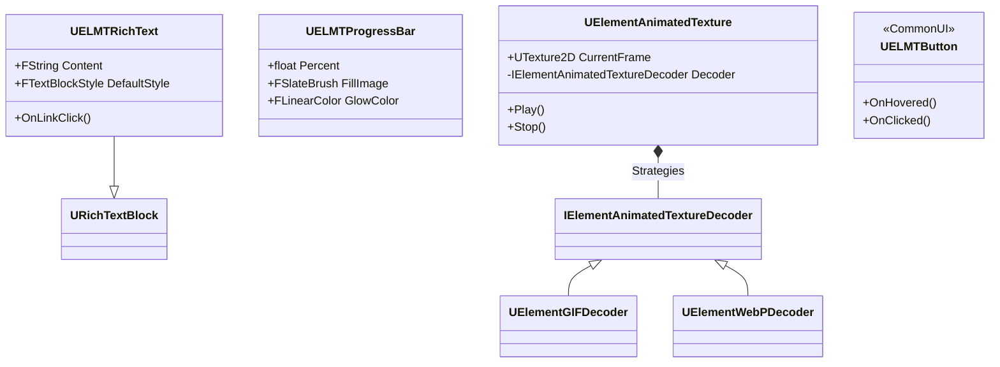
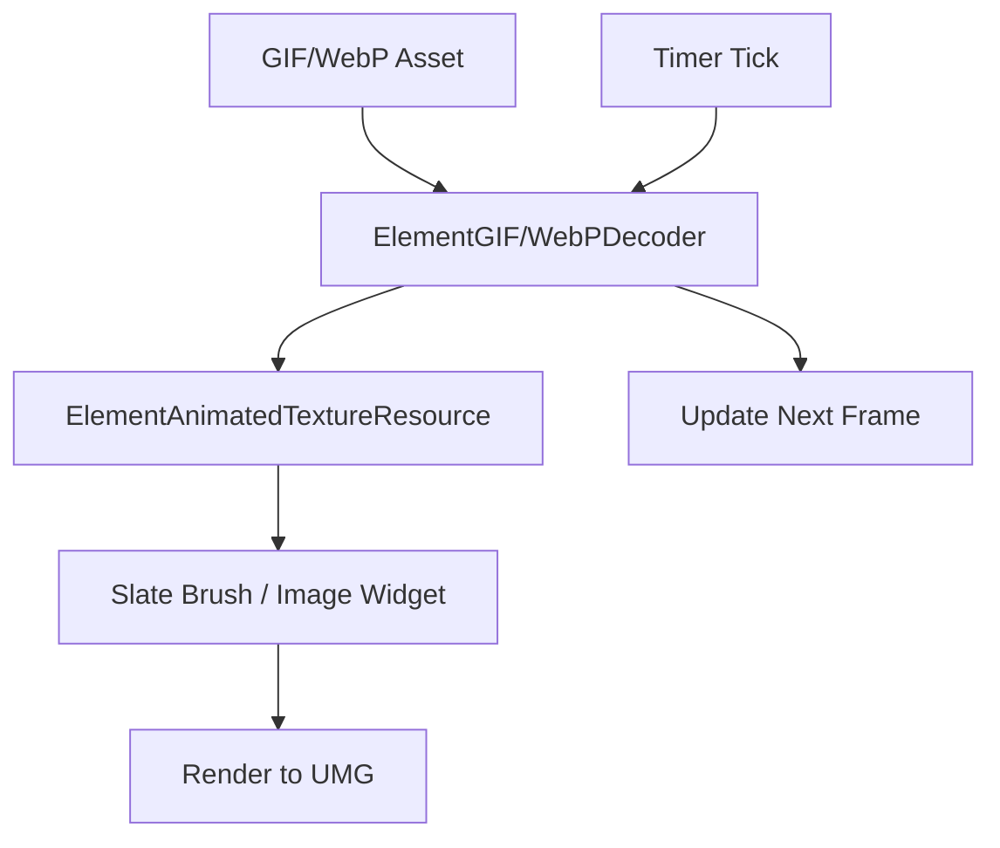

# UMG Element Kit - Technical Overview

## Architecture

**UMG Element Kit (UIKT)** is a professional-grade UI component library designed to replace or enhance standard Unreal Engine UMG widgets with a focus on high-end aesthetics, modularity, and advanced media support.

### Key Components

- **ELMT Widget Suite**: A set of widgets (`ELMTCombo`, `ELMTProgressBar`, `ELMTRichText`, etc.) that extend base UMG classes to provide more granular styling options (Gradients, Borders, Micro-animations).
- **Element Animated Texture**: A specialized system for playing non-standard animated formats like **GIF** and **WebP** directly within UMG. It uses a custom resource management system (`ElementAnimatedTextureResource`) to minimize memory impact.
- **Common UI Integration**: The kit is designed to work with Epic's **Common UI**, allowing `ELMT` widgets to automatically adapt to gamepad focus and display correct input icons.

## Rendering Flow (Animated Textures)

## Implementation Details

### Modular Styling
Unlike standard UMG widgets where styling is often baked into the widget blueprint, `UIKT` elements are designed to be style-agnostic. This allows a technical artist to update a central "Theme" and have all buttons, bars, and text boxes update their aesthetics globally.

### Performance-First Decoding
For animated textures, the kit performs decoding on background threads (using `giflib` and `libwebp` integrations) to prevent any frame drops on the main game thread during playback of high-resolution UI animations.

### Enhanced Rich Text
`ELMTRichText` expands on Unreal's base rich text implementation, providing better support for dynamic style overrides and tighter integration with the project's global typography settings.
